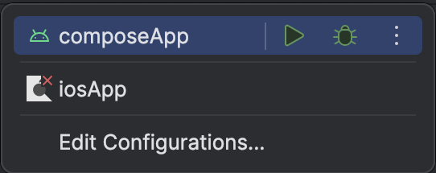

# Kotlin Multiplatform (Mobile) Demo

This demo shows how to work with **Kaptos** on a multiplatform project.
It is meant to run on both Android and iOS, but only Android is currently supported.

## Setting up your development environment

To setup the environment, please consult these [instructions](https://www.jetbrains.com/help/kotlin-multiplatform-dev/compose-multiplatform-setup.html).

## How to run

Choose a run configuration for an appropriate target in Android Studio and run it.

